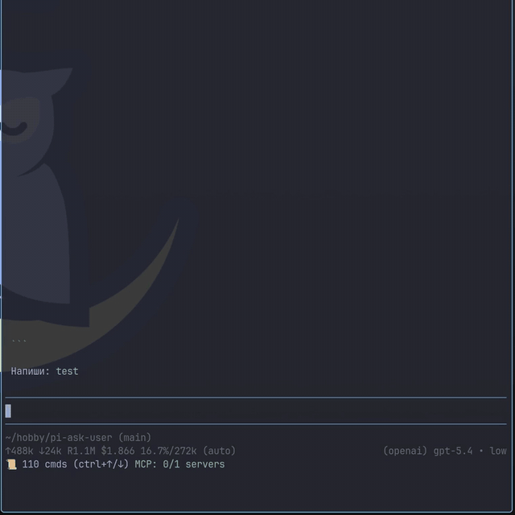

# pi-ask-user

A Pi package that adds an interactive `ask_user` tool for collecting user decisions during an agent run.

## Demo



High-quality video: [ask-user-demo.mp4](./media/ask-user-demo.mp4)

## Features

- Wrapped single-select option lists with titles and descriptions
- Responsive split-pane details preview on wide terminals with single-column fallback on narrow terminals
- Multi-select option lists
- Optional freeform responses
- Lightweight batch clarification mode for 2-7 related questions in one tool call
- User-toggleable extra context on structured selections
- Context display support
- Overlay mode — dialog floats over conversation, preserving context
- Pi-TUI-aligned keybinding and editor behavior
- Custom TUI rendering for tool calls and results
- System prompt integration via `promptSnippet` and `promptGuidelines`
- Optional timeout for auto-dismiss in both overlay and fallback input modes
- Structured `details` on all results for session state reconstruction
- Graceful fallback when interactive UI is unavailable
- Bundled `ask-user` skill for mandatory decision-gating in high-stakes or ambiguous tasks

## Bundled skill: `ask-user`

This package now ships a skill at `skills/ask-user/SKILL.md` that nudges/mandates the agent to use `ask_user` when:

- architectural trade-offs are high impact
- requirements are ambiguous or conflicting
- assumptions would materially change implementation

The skill follows a "decision handshake" flow:

1. Gather evidence and summarize context
2. Use single-question `ask_user` for one decision gate, or batch mode to ask several related clarification questions in one sweep when they are already known up front
3. Wait for explicit user choice
4. Confirm the decision, then proceed

See: `skills/ask-user/references/ask-user-skill-extension-spec.md`.

## Install

```bash
pi install npm:pi-ask-user
```

## Tool name

The registered tool name is:

- `ask_user`

## Parameters

### Single-question mode

| Parameter | Type | Default | Description |
|-----------|------|---------|-------------|
| `mode` | `"single"?` | omitted | Optional explicit single-question mode |
| `question` | `string` | *required* | The question to ask the user |
| `context` | `string?` | — | Relevant context summary shown before the question |
| `options` | `(string \| {title, description?})[]?` | `[]` | Multiple-choice options |
| `allowMultiple` | `boolean?` | `false` | Enable multi-select mode |
| `allowFreeform` | `boolean?` | `true` | Allow a custom response via the freeform option or by typing directly in the overlay |
| `allowComment` | `boolean?` | `false` | Expose a user-toggleable extra-context option in the overlay (`ctrl+g` or the toggle row) and collect an optional comment in fallback dialogs |
| `timeout` | `number?` | — | Auto-dismiss after N ms and return `null` if the prompt times out |

### Batch clarification mode

| Parameter | Type | Default | Description |
|-----------|------|---------|-------------|
| `mode` | `"batch"` | *required* | Enables a one-call clarification batch |
| `title` | `string?` | — | Short title shown above the batch UI |
| `context` | `string?` | — | Relevant context summary shown before the batch |
| `questions` | `BatchQuestion[]` | *required* | Related clarification questions; must contain 2-7 questions |
| `timeout` | `number?` | — | Auto-dismiss after N ms and return `null` if the prompt times out |

`BatchQuestion` reuses the current ask vocabulary where possible:

```ts
interface BatchQuestion {
  id: string;
  question: string;
  options?: (string | { title: string; description?: string })[];
  allowMultiple?: boolean;
  allowFreeform?: boolean;
  required?: boolean;
}
```

Batch-mode notes:
- Use it only for one related clarification pass, not unrelated or branching interviews.
- If you already know you need several related clarifications, prefer one batch instead of repeated single-question pauses.
- `questions` must contain between 2 and 7 entries.
- Batch questions do not support `allowComment`; add a final optional text question instead.
- In the interactive overlay, use `←` / `→` or `ctrl+n` / `ctrl+p` to switch questions.
- For selectable questions with `allowFreeform`, start typing to jump straight into a custom response.

## Example usage shapes

### Single-question mode

```json
{
  "question": "Which option should we use?",
  "context": "We are choosing a deploy target.",
  "options": [
    "staging",
    { "title": "production", "description": "Customer-facing" }
  ],
  "allowMultiple": false,
  "allowFreeform": true,
  "allowComment": true
}
```

### Batch clarification mode

```json
{
  "mode": "batch",
  "title": "Clarify implementation scope",
  "context": "I need a few details before proceeding.",
  "questions": [
    {
      "id": "surface",
      "question": "Which surface is in scope?",
      "options": ["Overlay", "RPC/headless fallback", "Both"],
      "allowFreeform": true,
      "required": true
    },
    {
      "id": "compat",
      "question": "Must the current single-question behavior remain exact?",
      "options": ["Yes", "No", "Mostly yes"],
      "allowFreeform": true,
      "required": true
    },
    {
      "id": "notes",
      "question": "Anything else I should optimize for?",
      "required": false
    }
  ]
}
```

## Result details

Successful tool results include the user's actual answer text in plain-text `content` so agents can continue even in integrations that surface only tool text. They also include a structured `details` object for rendering and session state reconstruction:

```typescript
type AskResponse =
  | { kind: "selection"; selections: string[]; comment?: string }
  | { kind: "freeform"; text: string }
  | {
      kind: "batch";
      answers: Array<
        | { id: string; kind: "selection"; selections: string[] }
        | { id: string; kind: "freeform"; text: string }
        | { id: string; kind: "skipped" }
      >;
    };

interface AskToolDetails {
  mode: "single" | "batch";
  question?: string;
  title?: string;
  context?: string;
  options?: QuestionOption[];
  questions?: BatchQuestion[];
  response: AskResponse | null;
  cancelled: boolean;
}
```

Single-question payloads and response variants remain unchanged. The new batch result branch is returned only when `mode: "batch"` is used.

## Changelog

See [CHANGELOG.md](./CHANGELOG.md).