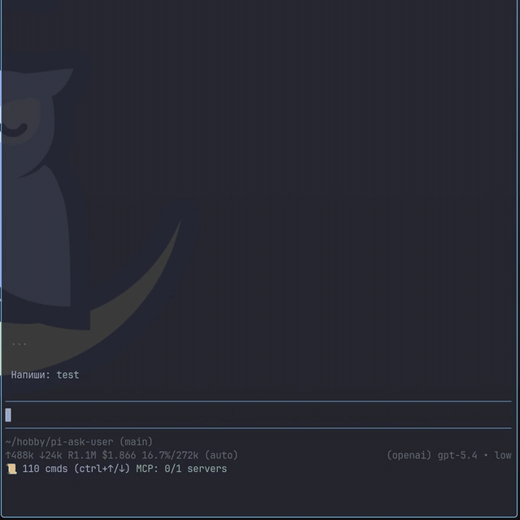

# pi-ask-user

A Pi package that adds an interactive `ask_user` tool for collecting explicit user decisions during an agent run.

> This repository is a heavily reworked fork of the original [`edlsh/pi-ask-user`](https://github.com/edlsh/pi-ask-user). It keeps the same tool name and core intent, but the `main` branch in this fork contains additional changes beyond upstream `v0.6.1`.

## Preview



High-quality video: [ask-user-demo.mp4](./media/ask-user-demo.mp4)

## What changed in this fork after upstream `v0.6.1`

- Batch clarification mode for collecting 2-7 related answers in a single `ask_user` call
- Plain-text answer summaries in tool `content`, so agents can continue even in integrations that only surface tool text
- Stronger freeform UX: direct typing in selectable prompts, safer backspace handling, and preserved batch drafts while moving between questions
- Updated tool guidance and bundled skill guidance around one focused question per call or one related clarification batch
- Internal refactor that split the runtime into core, overlay controller, overlay UI, and batch components for easier maintenance

## Features

- One focused decision gate in single-question mode
- One related clarification packet in `mode: "batch"`
- Single-select and multi-select option lists
- Optional freeform responses
- Optional comment capture for structured single-question answers
- Wrapped option rows with titles and descriptions
- Responsive split-pane details preview on wide terminals with single-column fallback on narrow terminals
- Context display support
- Overlay and inline display modes, selected per call or with `PI_ASK_USER_DISPLAY_MODE`
- Hide and restore an active overlay with `f7` (configurable with `PI_ASK_USER_OVERLAY_TOGGLE_KEY`) without recreating its component state
- Pi-TUI-aligned keybinding and editor behavior
- Custom TUI rendering for tool calls and results
- Graceful fallback when interactive custom UI is unavailable
- Optional timeout for auto-dismiss in both overlay and fallback input modes
- Structured `details` on all results for session state reconstruction
- Bundled `ask-user` skill for mandatory decision-gating in high-stakes or ambiguous tasks

## Bundled skill: `ask-user`

This package ships a skill at `skills/ask-user/SKILL.md` that nudges or mandates the agent to use `ask_user` when:

- architectural trade-offs are high impact
- requirements are ambiguous or conflicting
- assumptions would materially change implementation

The skill follows a decision handshake flow:

1. Gather evidence and summarize context
2. Use single-question `ask_user` for one decision gate, or batch mode to ask several related clarification questions in one sweep when they are already known up front and can be answered in one pass
3. Wait for explicit user choice
4. Confirm the decision, then proceed

The bundled skill is self-contained in `skills/ask-user/SKILL.md`.

## Install

### This fork from npm

```bash
pi install npm:@datspike/pi-ask-user@0.15.0
```

### This fork from git

```bash
pi install git:github.com/datspike/pi-ask-user
# or
pi install https://github.com/datspike/pi-ask-user
```

### Local checkout during development

```bash
pi install /absolute/path/to/pi-ask-user
```

### Original upstream npm package

```bash
pi install npm:pi-ask-user
```

Use the scoped package or the git/local install forms if you want the fork-only behavior documented in this repository. The unscoped `pi-ask-user` package remains the upstream release line.

## Tool name

The registered tool name is:

- `ask_user`

## Parameters

### Single-question mode

| Parameter | Type | Default | Description |
|-----------|------|---------|-------------|
| `mode` | `"single"?` | omitted | Optional explicit single-question mode |
| `question` | `string` | *required* | The question to ask the user |
| `context` | `string?` | - | Relevant context summary shown before the question |
| `options` | `{title: string, description?: string}[]?` | `[]` | Multiple-choice options exposed to the model |
| `allowMultiple` | `boolean?` | `false` | Enable multi-select mode |
| `allowComment` | `boolean?` | env / `false` | Expose a user-toggleable extra-context option and collect an optional comment; overrides `PI_ASK_USER_ALLOW_COMMENT` |
| `displayMode` | `"overlay" \| "inline"?` | env / `"overlay"` | UI presentation; overrides `PI_ASK_USER_DISPLAY_MODE` |
| `singleSelectLayout` | `"auto" \| "list"?` | env / `"auto"` | Use responsive preview panes or force a list; overrides `PI_ASK_USER_SINGLE_SELECT_LAYOUT` |
| `contextExpanded` | `boolean?` | env / `false` | Initial state for oversized context; overrides `PI_ASK_USER_CONTEXT_EXPANDED` |
| `overlayToggleKey` | `string?` | env / `"f7"` | Hide/restore shortcut; overrides `PI_ASK_USER_OVERLAY_TOGGLE_KEY`; use `off` to disable |
| `commentToggleKey` | `string?` | env / `"ctrl+g"` | Comment toggle shortcut; overrides `PI_ASK_USER_COMMENT_TOGGLE_KEY` |
| `timeout` | `number?` | - | Auto-dismiss after N ms; returns `cancelled: true` with `outcome: "timeout"` |

### Batch clarification mode

| Parameter | Type | Default | Description |
|-----------|------|---------|-------------|
| `mode` | `"batch"` | *required* | Enables a one-call clarification batch |
| `title` | `string?` | - | Short title shown above the batch UI |
| `context` | `string?` | - | Relevant context summary shown before the batch |
| `questions` | `BatchQuestion[]` | *required* | Related clarification questions; must contain 2-7 questions |
| `displayMode` | `"overlay" \| "inline"?` | env / `"overlay"` | UI presentation; parameter overrides environment |
| `overlayToggleKey` | `string?` | env / `"f7"` | Hide/restore shortcut in overlay mode |
| `timeout` | `number?` | - | Auto-dismiss after N ms; returns `cancelled: true` with `outcome: "timeout"` |

### Environment and keyboard behavior

Configuration precedence is per-call parameter, matching environment variable, then built-in default. Supported variables are `PI_ASK_USER_DISPLAY_MODE`, `PI_ASK_USER_SINGLE_SELECT_LAYOUT`, `PI_ASK_USER_CONTEXT_EXPANDED`, `PI_ASK_USER_ALLOW_COMMENT`, `PI_ASK_USER_OVERLAY_TOGGLE_KEY`, `PI_ASK_USER_COMMENT_TOGGLE_KEY`, and `PI_ASK_USER_EMIT_FULL_EVENTS`. Boolean values accept `1/true/yes/on` and `0/false/no/off`. Shortcut values accept `off`, `none`, `disabled`, `false`, or an empty string to disable the shortcut.

Use `ctrl+j` / `ctrl+k` as down/up aliases. Searchable single-select uses printable input as a fuzzy filter; Backspace removes filter characters and Escape clears the filter. Oversized context starts from `contextExpanded`, then can be expanded and collapsed with the first free key among `ctrl+e`, `ctrl+x`, and `ctrl+y`. This avoids configured overlay/comment shortcuts. If overlay and comment shortcuts are identical, overlay hide/restore takes priority and comment remains available through its selectable row. In overlay mode the help includes the hide shortcut; hiding also emits a notification with the restore key.

`herdr:blocked` emits `{ active: true, label: "Waiting for user response" }` while interactive input is pending and `{ active: false }` on every exit path. `ask:answered` and `ask:cancelled` are privacy-minimal by default: they omit context, option lists, question packets, and answer text. Set `PI_ASK_USER_EMIT_FULL_EVENTS=true` only when trusted consumers require full payloads.

`BatchQuestion` reuses the current ask vocabulary where possible:

```ts
interface BatchQuestion {
  id: string;
  question: string;
  options?: { title: string; description?: string }[];
  allowMultiple?: boolean;
  required?: boolean;
}
```

For runtime compatibility, legacy string options and defensive object aliases (`label`, `text`, `value`, `name`, `option`) are normalized before schema validation. New model-generated calls should use the flat `{ "title": "...", "description": "..." }` shape shown above.

Batch-mode notes:
- Use it only for one related clarification pass, not unrelated questions, branching interviews, or a single go/no-go decision.
- If you already know you need several related clarifications, prefer one batch instead of repeated single-question pauses.
- Keep batch questions independent enough to answer in one pass.
- `questions` must contain between 2 and 7 entries.
- Batch questions do not support `allowComment`; add a final optional text question instead.
- In the interactive overlay, use `left` / `right` or `ctrl+n` / `ctrl+p` to switch questions.
- For selectable questions, start typing to filter options or enter a custom response.

## Example usage shapes

### Single-question mode

```json
{
  "question": "Which option should we use?",
  "context": "We are choosing a deploy target.",
  "options": [
    { "title": "staging" },
    { "title": "production", "description": "Customer-facing" }
  ],
  "allowMultiple": false,
  "allowComment": true
}
```

### Batch clarification mode

```json
{
  "mode": "batch",
  "title": "Clarify implementation scope",
  "context": "I need a few details before proceeding.",
  "questions": [
    {
      "id": "surface",
      "question": "Which surface is in scope?",
      "options": [{ "title": "Overlay" }, { "title": "RPC/headless fallback" }, { "title": "Both" }],
      "required": true
    },
    {
      "id": "compat",
      "question": "Must the current single-question behavior remain exact?",
      "options": [{ "title": "Yes" }, { "title": "No" }, { "title": "Mostly yes" }],
      "required": true
    },
    {
      "id": "notes",
      "question": "Anything else I should optimize for?",
      "required": false
    }
  ]
}
```

## Result details

Successful tool results include the user's actual answer text in plain-text `content` so agents can continue even in integrations that surface only tool text. Results also include a structured `details` object for rendering and session state reconstruction:

```typescript
type AskResponse =
  | { kind: "selection"; selections: string[]; comment?: string }
  | { kind: "freeform"; text: string }
  | {
      kind: "batch";
      answers: Array<
        | { id: string; kind: "selection"; selections: string[] }
        | { id: string; kind: "freeform"; text: string }
        | { id: string; kind: "skipped" }
      >;
    };

interface AskToolDetails {
  mode: "single" | "batch";
  question?: string;
  title?: string;
  context?: string;
  options?: QuestionOption[];
  questions?: BatchQuestion[];
  response: AskResponse | null;
  cancelled: boolean; // compatibility flag: true for cancel, timeout, and abort
  outcome: "answered" | "cancelled" | "timeout" | "aborted";
}
```

Single-question payloads and response variants remain unchanged. The batch result branch is returned only when `mode: "batch"` is used. Configuration precedence is always per-call parameter, then the corresponding environment variable, then the documented default. Manual cancellation, timeout, and `AbortSignal` remain backward-compatible through `cancelled: true` and are distinguished by `outcome`.

## Changelog

See [CHANGELOG.md](./CHANGELOG.md).
